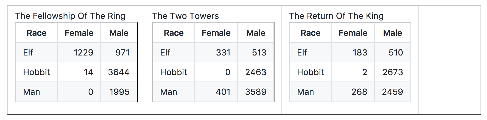

```{r setup, include=FALSE}
knitr::opts_chunk$set(echo = TRUE)
```

## Tidy Data and Data Analysis Pipeline


> It is often said that 80% of data analysis is spent on the process of cleaning and preparing the data. (Dasu and Johnson, 2003)


### What is tidy data?
* every column in your dataframe represents a variable
* every row represents an observation
* also known as long format


### Why do we need tidy data?
* easy to manipulate (variable are easy to access as vectors)
* easy to visualize
* easy to model
* hard for human eyeballs, but easy for computation

> If you are struggling to make a figure, for example, stop and think hard about whether your data is tidy. Untidiness is a common, often overlooked cause of agony in data analysis and visualization. (Jenny Bryan, STAT545)


### Example of untidy data (Jenny Bryan, STAT545)



### Why are these examples of untidy data?
* What's the total number of words spoken by male hobbits in all three movies?
* Is there a more talkative `Race`? 


### How do we turn these tables into a tidy dataframe?

Let's load our required packages:

```{r}
library(tidyverse)
```


Let's read these dataframes in:

```{r}
fship <- read_csv("The_Fellowship_Of_The_Ring.csv")

ttow <- read_csv("The_Two_Towers.csv")

rking <- read_csv("The_Return_Of_The_King.csv")
```


Collect untidy dataframes into one dataframe:

```{r}
lotr_untidy <- dplyr::bind_rows(fship, ttow, rking)
```

This dataframe is still untidy because "word count" is spread out between two columns, `Male` and `Female`. So to make this dataframe tidy, we need to:

* `gather()` up the word counts into one column
* create a new column for `Gender`

Time to make this dataframe tidy!

```{r}
lotr_tidy <-
  gather(lotr_untidy, key = 'Gender', value = 'Words', Female, Male)

lotr_tidy
```

Want to see what else you can do with this dataset? 
Check out Jenny Bryan's [LOTR GitHub Repo](https://github.com/jennybc/lotr-tidy)!

## Challenge Question 1

`spread()` is another tidyr function that converts a dataframe from the long format to the wide format. How would you convert the `lotr_tidy` dataframe back into the `lotr_untidy` dataframe?


## Challenge Question 2

In the EDAWR dataset, `cases`, we have the number of tuberculosis cases reported in France, Germany and United States from 2011 to 2013. What are the total number of tuberculosis cases reported over three years per country?

```{r}
devtools::install_github("rstudio/EDAWR")
library(EDAWR)
cases
```

## Other useful functions from tidyr - Separate and Unite

Let's use the EDAWR dataset again. This time, we are going to use the `storms` data, which has the maximum wind speeds for six Atlantic hurricanes. 

```{r}
storms
```

`separate()` allows you to separate a column into multiple other columns by using a separator. For example, if we want to separate the `date` column into `year`, `month`, `day`, we can do that by:

```{r}
storms.sep <- separate(storms, date, c("year", "month", "day"), sep = "-")
```

## Challenge Question 3

How do you combine the three separate columns, `year`, `month`, `day`, that you just created in `storms.sep` back into one column, `date`? Hint: `unite()` works the opposite way as `separate()`.

